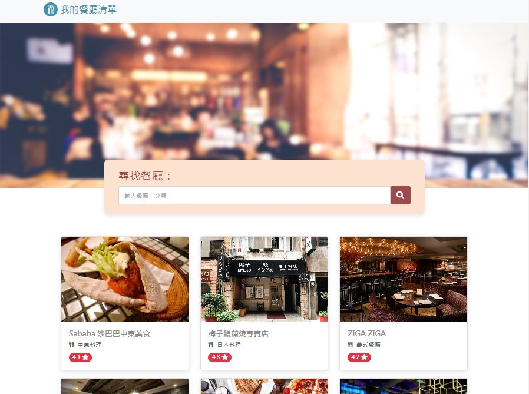

# My Restaurant List


## Description 
此專案為: My Restaurant List 我的餐廳清單，可以查詢、瀏覽喜愛的餐廳資訊。

## Features
* 首頁可以看到所有餐廳卡片
* 使用者可以點擊卡片查看餐廳詳細資訊
   * 類別
   * 地址
   * 電話
   * 描述
   * 圖片
* 使用者可以連結餐廳地址至Google Map
* 使用者可以透過搜尋餐廳名稱、類別來找到特定餐廳

##  Quick Start
1. 安裝 node.js 與 npm
2. 將專案 clone 到本地
3. 本地開啟後，由終端機進入資料夾，輸入:
```
npm install
```
4. 安裝完成後輸入:
```
npm run start
```
5. 看到以下訊息代表順利完成，用瀏覽器打開以下網址:
     Listening on [http://localhost:3000](http://localhost:3000)
6. 若欲暫停:
```
ctrl + c
```

## Dev Tools
  * Node.js 14.16.0
  * Express 4.16.4
  * Express-Handlebars 3.0.0
  * Bootstrap 5.1.3
  * Font-awesome 5.8.1


  


